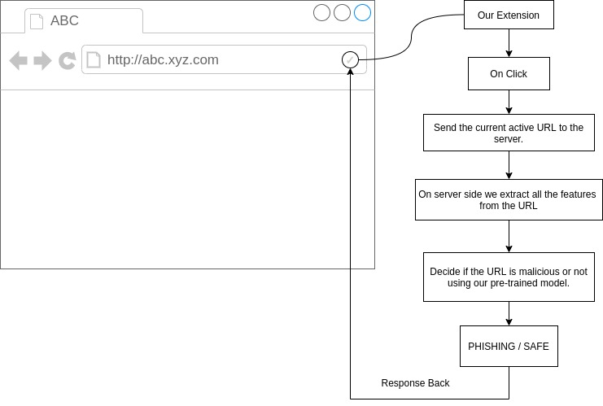
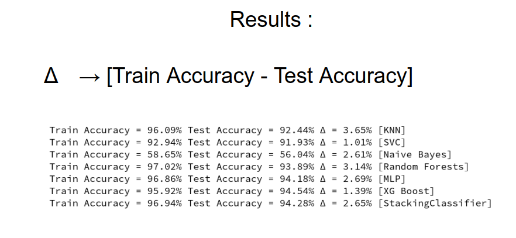

# Introduction

**Problem Statement:** Automated AI/ML System for Detecting and Mitigating Online Fraud

Objective:

Create and implement an AI/ML-based system that can autonomously analyze and categorize online content, distinguishing between authentic and fake/fraudulent websites, advertisements, and customer care numbers. The system aims to achieve the following:

Website Authentication: Develop algorithms to assess the legitimacy of websites based on domain, SSL certificates, and other authentication indicators.
Ad Content Analysis: Implement NLP and image recognition techniques to evaluate the authenticity and accuracy of ad content.
Customer Care Number Verification: Establish a database of verified customer care numbers and compare incoming numbers to identify potential scams.
Real-time Detection: Enable real-time analysis of online content to prevent users from accessing fake or malicious websites.
User Feedback Integration: Incorporate mechanisms for user feedback to enhance the system's accuracy and adapt to evolving fraudulent tactics.

**Sahi Hai** was made by keeping in the mind the regular internet user who has to go through many websites during his time on the internet and may fall under a trap of a malicious website who might want the user's information or want to introduce malware in their system. Our chrome extension helps the user to check a particular website whether it is safe for browsing or not we have used a pretrained ml model to do so.

# How it Works ?

The ML model extracts the following features from a url :

  
| Feattures     Used                  |                                   |                            |                     |
| ----------------------------------- | --------------------------------- | -------------------------- | ------------------- |
| Having IP address                   | URL Length                        | URL Shortening service     | Having @ symbol     |
| Having double slash                 | Having dash symbol(Prefix Suffix) | Having multiple subdomains | SSL Final State     |  | Domain Registration Length | Favicon | HTTP or HTTPS token in domain name | Request URL |
| URL of Anchor                       | Links in tags                     | SFH - Server from Handler. | Submitting to email |
| Abnormal URL                        | IFrame                            | Age of Domain              | DNS Record          |
| Web Traffic -  using data.alexa.com | Google Index                      |                            | Statistical Reports |
 
 
 
  We have iterated multiple times during training phase :
  
  <!-- 1. Random Forest Model ( 93.14% Accuracy )
  1. MLP Model ( 94.17% Accuracy ) -->
  

 

## What Problem it Solves ?

 Every other website in today's day and age on the internet wants to collect data of its users by tricking them into giving away their credentials for fraud or many such vindictive acts. Naive users using a browser have no idea about the backend of the page. The users might be tricked into giving away their credentials or downloading malicious data.

We have created an extension for Chrome that will act as middleware between the users and the malicious websites and relieve users of giving away to such websites.
Our project was made by keeping in the mind the regular internet user who has to go through many websites during his time on the internet and may fall under a trap of a malicious website who might want the user's information or want to introduce malware in their system. Our chrome extension helps the user to check a particular website whether it is safe for browsing or not

# Tech Stack

- [HTML](https://www.w3schools.com/html/) - The front-end development language used for creating extension.

- [CSS](https://www.w3schools.com/css/) - The  front-end development language used for creating extension.

- [Python](https://www.python.org/) - The Programing Language used to parse features from a website and for training/testing of the ML model.
- [JavaScript](https://www.javascript.com/) - The scripting language used for creating the extension and sending  requests to the served Ml model.
- [Php](https://www.php.net/) - The scripting language used for serving the Ml model .

- [Beautiful Soup](https://pypi.org/project/beautifulsoup4/) - The library used to scrape websites from a url.
- [Googlesearch](https://pypi.org/project/googlesearch-python/) - The library for  performing google search's during feature extraction.

- [whois](https://pypi.org/project/whois/) - The package for retrieving WHOIS information of domains during feature extraction.
- [scikit-learn](https://scikit-learn.org/stable/) -
  The library used for training ML models.
 
